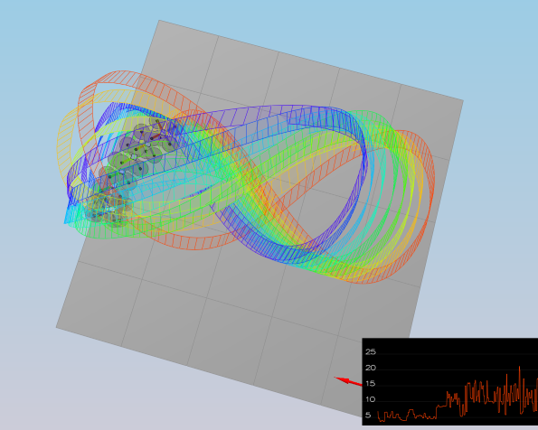
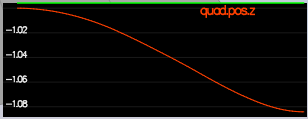
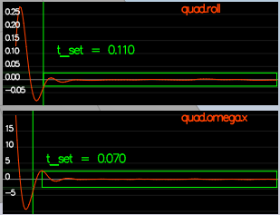
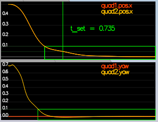
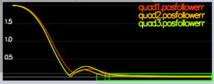
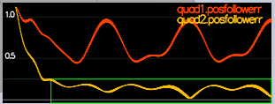
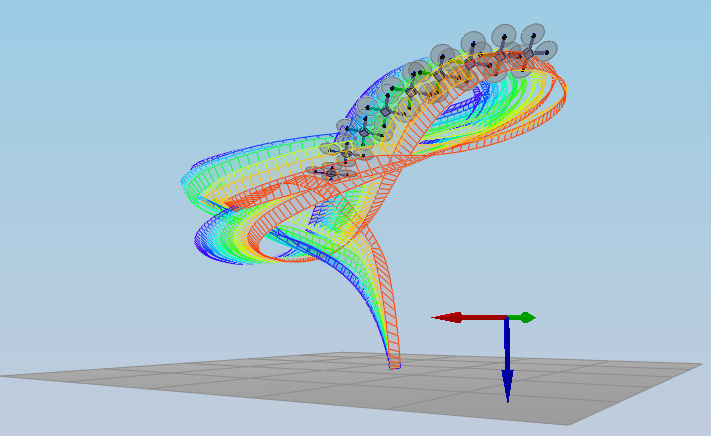

## Project: Building a Controller


---
## Writeup
1. The writeup / README should include a statement and supporting figures / images that explain how each rubric item was addressed, and specifically where in the code each step was handled.
---
## Implemented Controller
2. Implemented body rate control in C++.\
The controller should be a proportional controller on body rates to commanded moments. The controller should take into account the moments of inertia of the drone when calculating the commanded moments.

* The body rate controller generates the desired roll moment, pitch moment, and yaw moment commands by multiplying the moments of inertia by the rate error and the gain parameter kpPQR. The code snippet below shows how this is implemented in code:

```
V3F moments_of_inertia(Ixx, Iyy, Izz);
V3F rate_error = pqrCmd - pqr;

momentCmd = moments_of_inertia * kpPQR * rate_error;
```
* Below are the used angle rate gains from `QuadControlParams.txt`:
```
kpPQR = 80, 80, 10
```

3. Implement roll pitch control in C++.\
The controller should use the acceleration and thrust commands, in addition to the vehicle attitude to output a body rate command. The controller should account for the non-linear transformation from local accelerations to body rates. Note that the drone's mass should be accounted for when calculating the target angles.

* The roll pitch contol function generates the roll and pitch rate by first checking if the desired collective thrust of the quad is greater than 0. If this is the case the roll (p) and pitch (q) commands are calculated in radians/s. The collective acceleration and the roll/pitch gain kpBank are used to calculate the correct roll and pitch rate as seen in the implemeted code below:

```
float collective_acceleration = collThrustCmd / mass;

if (collThrustCmd > 0)
{
    float target_R13 = - CONSTRAIN(accelCmd.x / collective_acceleration, - maxTiltAngle, maxTiltAngle);
    float target_R23 = - CONSTRAIN(accelCmd.y / collective_acceleration, - maxTiltAngle, maxTiltAngle);
    float x_error = R(0, 2) - target_R13;
    float y_error = R(1, 2) - target_R23;

    pqrCmd.x = (1 / R(2, 2)) * (- R(1, 0) * kpBank * x_error + R(0, 0) * kpBank * y_error);
    pqrCmd.y = (1 / R(2, 2)) * (- R(1, 1) * kpBank * x_error + R(0, 1) * kpBank * y_error);
}
else
{
    pqrCmd.x = 0.0f;
    pqrCmd.y = 0.0f;
    collThrustCmd = 0.0f;
}
```

*  The roll/pitch gain `kpBank` is tuned with the following value:
```
kpBank = 12
```

4. Implement altitude controller in C++.\
The controller should use both the down position and the down velocity to command thrust. Ensure that the output value is indeed thrust (the drone's mass needs to be accounted for) and that the thrust includes the non-linear effects from non-zero roll/pitch angles.\
Additionally, the C++ altitude controller should contain an integrator to handle the weight non-idealities presented in scenario 4.

* The implemented code, as seen below, generates the vertical acceleration or thrust by calculating the vertical position error, the integrated altitude error and the vertical velocity error in addition to limiting the vertical velocity to between the maxAscentRate and maxDescentRate. These are then used to get the feed-forward vertical acceleration and by taking into account the mass, finally the collective thrust command is generated:

```
float vertical_position_error = posZCmd - posZ;
integratedAltitudeError = integratedAltitudeError + vertical_position_error * dt;
velZCmd = velZCmd + kpPosZ * vertical_position_error;
velZCmd = CONSTRAIN(velZCmd, - maxAscentRate, maxDescentRate); // Limit the ascent/descent rate

float vertical_velocity_error = velZCmd - velZ;
accelZCmd = accelZCmd + KiPosZ * integratedAltitudeError + kpVelZ * vertical_velocity_error;

float R33 = R(2, 2);
thrust = mass * (9.81f - accelZCmd) / R33;
```

*  The `kpPosZ` and `kpPosZ` parameters are tuned with the following values:
```
kpPosZ = 3
kpVelZ = 12
```

5. Implement lateral position control in C++.\
The controller should use the local NE position and velocity to generate a commanded local acceleration.

* Lateral position control first calculates the desired velocity by taking into account the kpPosXY parameter and the position error in addition to limiting the maximum horizontal velocity to maxSpeedXY. This desired velocity is then used to calculate the velocity error. This in turn, in combination with the kpVelXY parameter generates the commanded local acceleration, which is finally being limited by maxAccelXY. Below is the implemeted code:

```
velCmd = velCmd + kpPosXY * (posCmd - pos);

// Limit speed
float velocity_norm = sqrt(velCmd.x * velCmd.x + velCmd.y * velCmd.y);

if (velocity_norm > maxSpeedXY)
{
    velCmd = velCmd * maxSpeedXY / velocity_norm;
}

accelCmd = accelCmd + kpVelXY * (velCmd - vel);

// Limit acceleration
float acceleration_norm = sqrt(accelCmd.x * accelCmd.x + accelCmd.y * accelCmd.y);

if (acceleration_norm > maxAccelXY)
{
    accelCmd = accelCmd * maxAccelXY / acceleration_norm;
}
```

*  The `kpPosXY` and `kpVelXY` parameters are tuned with the following values:
```
kpPosXY = 3
kpVelXY = 12
```

6. Implement yaw control in C++.\
The controller can be a linear/proportional heading controller to yaw rate commands (non-linear transformation not required).

* The yaw controller, see code below, first ensures the target is within range of 0 to 2*pi. Then the yaw error is being calculated in order to be between -pi and pi. The desired yaw rate is then calculated by using the tuning parameter kpYaw. 

```
// Ensure the target is within range of 0 to 2*pi
float pi_range = 2.0f * F_PI;

yawCmd = fmodf(yawCmd, pi_range);

float yaw_error = yawCmd - yaw;

if (yaw_error > F_PI)
{
    yaw_error = yaw_error - pi_range;
}
else if (yaw_error < - F_PI)
{
    yaw_error = yaw_error + pi_range;
}

yawRateCmd = kpYaw * yaw_error;
```

*  The `kpYaw` parameter is tuned with the following value:
```
kpYaw = 4
```

7. Implement calculating the motor commands given commanded thrust and moments in C++.\
The thrust and moments should be converted to the appropriate 4 different desired thrust forces for the moments. Ensure that the dimensions of the drone are properly accounted for when calculating thrust from moments.

* The individual motor thrust commands are calculated by first calculating the desired rotation moments about each axis. To do so the arm length and drag thrust ratio need to be used. These rotation moments are then used in combination with the desired collective thrust to get the individual motor thrust commands. Below is the implemented code:

```
float arm_length = L / sqrt(2); // You'll need the arm length parameter L
float moment_x = momentCmd.x / arm_length; // momentCmd: desired rotation moment about each axis [N m]
float moment_y = momentCmd.y / arm_length;
float moment_z = momentCmd.z / kappa; // You'll need the drag/thrust ratio kappa

cmd.desiredThrustsN[0] = (collThrustCmd + moment_x + moment_y - moment_z) / 4.f; // front left
cmd.desiredThrustsN[1] = (collThrustCmd - moment_x + moment_y + moment_z) / 4.f; // front right
cmd.desiredThrustsN[2] = (collThrustCmd + moment_x - moment_y + moment_z) / 4.f; // rear left
cmd.desiredThrustsN[3] = (collThrustCmd - moment_x - moment_y - moment_z) / 4.f; // rear right
```
---
## Flight Evaluation
8. Your C++ controller is successfully able to fly the provided test trajectory and visually passes inspection of the scenarios leading up to the test trajectory.\
Ensure that in each scenario the drone looks stable and performs the required task. Specifically check that the student's controller is able to handle the non-linearities of scenario 4 (all three drones in the scenario should be able to perform the required task with the same control gains used).

* below is the list of all the used tuning parameters:

```
# Position control gains
kpPosXY = 3
kpPosZ = 3
KiPosZ = 30

# Velocity control gains
kpVelXY = 12
kpVelZ = 12

# Angle control gains
kpBank = 12
kpYaw = 4

# Angle rate gains
kpPQR = 80, 80, 10
```

* In all required scenario's the tests are passing, the drone looks stable and performs the required tasks. Below are the test results for all the individual scenario's:

Scenario #1\

```
(../config/1_Intro.txt)
PASS: ABS(Quad.PosFollowErr) was less than 0.500000 for at least 0.800000 seconds
```
Scenario #2\

```
(../config/2_AttitudeControl.txt)
PASS: ABS(Quad.Roll) was less than 0.025000 for at least 0.750000 seconds
PASS: ABS(Quad.Omega.X) was less than 2.500000 for at least 0.750000 seconds
```
Scenario #3\

```
(../config/3_PositionControl.txt)
PASS: ABS(Quad1.Pos.X) was less than 0.100000 for at least 1.250000 seconds
PASS: ABS(Quad2.Pos.X) was less than 0.100000 for at least 1.250000 seconds
PASS: ABS(Quad2.Yaw) was less than 0.100000 for at least 1.000000 seconds
```
Scenario #4\

```
(../config/4_Nonidealities.txt)
PASS: ABS(Quad1.PosFollowErr) was less than 0.100000 for at least 1.500000 seconds
PASS: ABS(Quad2.PosFollowErr) was less than 0.100000 for at least 1.500000 seconds
PASS: ABS(Quad3.PosFollowErr) was less than 0.100000 for at least 1.500000 seconds
```
Scenario #5\

```
(../config/5_TrajectoryFollow.txt)
PASS: ABS(Quad2.PosFollowErr) was less than 0.250000 for at least 3.000000 seconds
```

